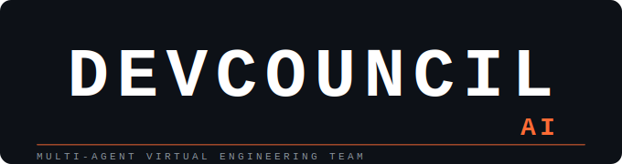

<div align="center">



### Your entire senior engineering team — powered by collaborative AI.

<br/>

[](LICENSE)
[](https://python.org)
[](https://nextjs.org)
[](https://fastapi.tiangolo.com)
[](https://groq.com)
[](https://neon.tech)
[](https://vercel.com)
[](https://render.com)

<br/>

<!-- **[Live Demo](https://devcouncil.ai)** · **[Watch 3-Min Demo Video](#)** · **[Read the Docs](#documentation)** -->

<br/>

> *"Seven AI agents just argued about my codebase — and they were all right about different things."*
> — first user who ran a demo analysis

</div>

---

## The Problem We're Solving

Every production codebase needs eyes from at least six different experts:

| Domain | Without Expert Access |
|---|---|
| 🏗️ Architecture | 40% of dev time lost to technical debt |
| 🔐 Security | 60% of breaches come from known, preventable flaws |
| 🧪 QA | 80% of bugs are caught in production, not development |
| 📝 Documentation | $50K+ lost per project in onboarding and handovers |
| 📋 Product | 1 in 3 built features are never used |
| 🔍 Code Quality | 15–50% overhead added by poor code across a project's lifetime |

**31 million solo developers and small teams** build most of the world's software without access to even one of these specialists.

Current AI tools — Copilot, Cursor, ChatGPT — give you **one model's opinion**. A single model cannot disagree with itself. It cannot catch that the architecture it just recommended triples your attack surface — because that requires a Security Engineer pushing back on an Architect in real time.

---

## What DevCouncil AI Does

DevCouncil AI runs **seven specialized AI agents in parallel** against your GitHub repository. Each agent independently analyzes your code from its own domain. Then they **debate**.

```
You paste a GitHub URL.

Architect Agent ──────────────────────────────► "Migrate to microservices — clear domain boundaries."
                                                  confidence: 78%
Security Agent ───────────────────────────────► "Microservices triple the attack surface.
                                                  JWT between services = 4 new vuln classes."
                                                  confidence: 91%

                    ⚡ CONFLICT DETECTED

Consensus Director ───────────────────────────► "Modular monolith adopted. Security concern
                                                  overrides architecture preference at current scale."

You get a report. The debate is transparent. The decision is explained.
```

**This is what a real senior engineering team does. We built it for $0.05 per analysis.**

---

## The Seven Agents

<table>
<tr>
<td width="50%">

**🏗️ Architect Agent**
System design authority. Owns scalability, design patterns, technology choices, and refactoring priorities. The only agent that can challenge a Security recommendation on proportionality grounds.

**🔐 Security Agent**
Vulnerability authority. Grounds every finding in Bandit/Semgrep static analysis output. Has **veto power** — CRITICAL findings cannot be removed from the final report by any other agent.

**🔍 Code Reviewer Agent**
Code quality authority. Provides line-level citations for every recommendation. Never gives generic advice — "fix line 47 in `payment.py`", not "improve error handling".

**📋 Product Manager Agent**
Requirements authority. Identifies gaps between what was specified and what was built. Flags TODO comments, missing CRUD operations, and incomplete user flows.

</td>
<td width="50%">

**🧪 QA Tester Agent**
Test coverage authority. Generates **executable test cases** in your project's testing framework — pytest or Jest — not descriptions of what to test.

**📝 Documentation Agent**
Documentation authority. Produces a real `README.md`, API reference, and onboarding guide from your code. Outputs usable files, not templates.

**⚖️ Consensus Director Agent**
Synthesis authority. Collects all findings, resolves conflicts using explicit priority rules, and explains every decision. Does not average disagreements — it arbitrates them.

</td>
</tr>
</table>

---

## The Discussion Room

The highest-impact feature is watching it happen in real time.

```
┌─────────────────────────────────────────────────────────────────┐
│  🔴 LIVE  DevCouncil AI — Discussion Room                        │
├─────────────────────────────────────────────────────────────────┤
│                                                                   │
│  🏗️  Architect Agent  [confidence: 78%]              FINDING     │
│  ─────────────────────────────────────────────────────────────  │
│  Recommend decomposing UserService into two bounded             │
│  contexts. File: src/services/users.py shows clear             │
│  domain boundary at line 234.                                   │
│                                                                   │
│  🔐  Security Agent  [confidence: 91%]              CHALLENGE ⚡ │
│  ─────────────────────────────────────────────────────────────  │
│  Challenging architect_3. Decomposition introduces JWT          │
│  inter-service auth — 4 new attack vectors not present in      │
│  current stack. Semgrep rule jwt-none-algorithm confirmed       │
│  risk in: src/middleware/auth.py:18                             │
│                                                                   │
│  🏗️  Architect Agent  [confidence: 62%]              CONCEDE  ✓ │
│  ─────────────────────────────────────────────────────────────  │
│  Security concern is valid at current scale. Withdrawing        │
│  microservices recommendation. Modular monolith preferred.      │
│                                                                   │
│  ⚖️  Consensus Director                           RESOLUTION  ✅ │
│  ─────────────────────────────────────────────────────────────  │
│  Modular monolith adopted. Security Agent's concern             │
│  overrides architectural preference — attack surface            │
│  expansion is disproportionate to the benefit at <1000         │
│  users. Architect Agent conceded in round 2.                    │
│                                                                   │
└─────────────────────────────────────────────────────────────────┘
```

Every message streams in real time via Server-Sent Events. Every conflict is explained. Every confidence score is visible.

---

## Architecture

```
┌─────────────────────────────────────────────────────────────────────┐
│                         USER BROWSER                                │
│              Next.js 14 · TypeScript · Tailwind · ShadCN           │
│                    SSE Consumer · Report Renderer                   │
└───────────────────────────┬─────────────────────────────────────────┘
                            │ REST + SSE
┌───────────────────────────▼─────────────────────────────────────────┐
│                       FASTAPI BACKEND                               │
│                    (Render · Docker · Python 3.11)                  │
│  ┌─────────────┐  ┌──────────────┐  ┌───────────────────────────┐  │
│  │  Ingestion  │  │ Static Anal. │  │    AI Orchestrator        │  │
│  │  GitHub API │  │ Bandit       │  │    asyncio.gather         │  │
│  │  File Tree  │  │ Semgrep      │  │    7 parallel agents      │  │
│  │  Content    │  │ Tree-Sitter  │  │    Discussion Phase       │  │
│  └─────────────┘  └──────────────┘  └───────────────────────────┘  │
└───────────┬───────────────┬──────────────────────┬──────────────────┘
            │               │                      │
    ┌───────▼──────┐ ┌──────▼──────┐      ┌───────▼────────┐
    │    Neon      │ │   Upstash   │      │   Groq API     │
    │  PostgreSQL  │ │    Redis    │      │ Llama-3.3-70b  │
    │  (6 tables)  │ │  (cache +   │      │ (7 agents run  │
    │              │ │rate limits) │      │  in parallel)  │
    └──────────────┘ └─────────────┘      └────────────────┘
```

### Technology Decisions

| Layer | Choice | Why |
|---|---|---|
| Frontend | Next.js 14 (App Router) | Native SSE streaming support; TypeScript for agent message type safety |
| Backend | FastAPI + Python | Only language with mature Bandit + Tree-Sitter + Semgrep bindings |
| LLM | Groq + Llama-3.3-70b | Fastest inference on free tier (~500 tok/s); full 7-agent analysis under $0.05 |
| Orchestration | `asyncio.gather` | LangGraph adds 2-day learning curve; direct async is sufficient for MVP |
| Database | Neon PostgreSQL | Serverless, free tier, standard SQL — no ORM complexity needed |
| Cache | Upstash Redis | Agent response caching; session state; rate limiting (10K cmd/day free) |
| Auth | GitHub OAuth + JWT | Single-click login for devs; `httponly` cookie prevents XSS token theft |
| Static Analysis | Bandit + Semgrep | Grounds agent findings in real detections — prevents LLM hallucination |
| AST | Tree-Sitter | File-path + line-number citations require structured code parsing |
| Deploy | Vercel + Render | Both free tier; Render supports persistent processes for SSE streaming |

---

## Hallucination Mitigation

This is the engineering decision that separates DevCouncil AI from "ChatGPT with agent names".

Every finding must be grounded in a concrete artifact:

```python
# Security Agent cannot invent vulnerabilities.
# It can ONLY cite what Bandit/Semgrep detected — or what it reads directly in file contents.

class SecurityFinding(BaseModel):
    file_path: str        # required — no file path = no finding
    line_number: int      # required for code-level claims
    source: Literal["bandit", "semgrep", "ast", "llm_inferred"]
    verified: bool        # True only if grounded in static analysis output
    confidence: int       # below 60 = excluded from output

# Any recommendation without a source citation is automatically flagged
# as 'unverified' and deprioritized in the consensus report.
```

The Consensus Director cross-references every finding against source artifacts before including it in the final report.

---

## Getting Started

### Prerequisites

- Python 3.11+
- Node.js 18+
- Docker (for backend deployment)
- Groq API key (free at [console.groq.com](https://console.groq.com))
- GitHub OAuth app credentials

### 1. Clone the Repository

```bash
git clone https://github.com/your-org/devcouncil-ai.git
cd devcouncil-ai
```

### 2. Backend Setup

```bash
cd backend

# Install Python dependencies
pip install -r requirements.txt

# Install system dependencies for static analysis
pip install bandit semgrep

# Install Tree-Sitter language grammars
python scripts/install_grammars.py

# Configure environment variables
cp .env.example .env
```

Edit `.env`:
```env
DATABASE_URL=postgresql://...           # Neon connection string
REDIS_URL=redis://...                   # Upstash Redis URL
GROQ_API_KEY=gsk_...                   # Groq API key
GITHUB_CLIENT_ID=...                    # GitHub OAuth app
GITHUB_CLIENT_SECRET=...
JWT_SECRET=your-secret-here
FRONTEND_URL=http://localhost:3000
```

```bash
# Run database migrations
alembic upgrade head

# Start the backend
uvicorn app.main:app --reload --port 8000
```

### 3. Frontend Setup

```bash
cd frontend

# Install dependencies
npm install

# Configure environment variables
cp .env.local.example .env.local
```

Edit `.env.local`:
```env
NEXTAUTH_URL=http://localhost:3000
NEXTAUTH_SECRET=your-secret-here
GITHUB_CLIENT_ID=...
GITHUB_CLIENT_SECRET=...
NEXT_PUBLIC_API_URL=http://localhost:8000
```

```bash
# Start the frontend
npm run dev
```

Visit `http://localhost:3000`. Paste any public GitHub URL. Watch the council convene.

### 4. Docker (Recommended for Backend)

```bash
cd backend
docker build -t devcouncil-backend .
docker run -p 8000:8000 --env-file .env devcouncil-backend
```

The Dockerfile installs Bandit, Semgrep, and Tree-Sitter grammars automatically.

---

## Project Structure

```
devcouncil-ai/
├── backend/
│   ├── app/
│   │   ├── main.py                  # FastAPI app entry point
│   │   ├── config.py                # Configuration settings
│   │   ├── routers/
│   │   │   ├── auth.py              # GitHub OAuth + JWT
│   │   │   ├── analysis.py          # POST /analysis, GET /stream
│   │   │   └── reports.py           # Report history
│   │   ├── services/
│   │   │   ├── ingestion.py         # GitHub API client + file extraction
│   │   │   ├── orchestrator.py      # asyncio.gather parallel agents
│   │   │   └── cache.py             # Caching service
│   │   ├── agents/
│   │   │   ├── base.py              # BaseAgent: call_llm, parse, retry
│   │   │   ├── architect.py
│   │   │   ├── security.py
│   │   │   ├── code_reviewer.py
│   │   │   └── consensus_director.py
│   │   └── models/
│   │       ├── db.py                # SQLAlchemy models
│   │       └── schemas.py           # Pydantic request/response schemas
│   ├── devcouncil.db                # SQLite database
│   ├── requirements.txt
│   └── .env.example
│
├── frontend/
│   ├── app/
│   │   ├── page.tsx                 # Landing page
│   │   ├── layout.tsx               # Root layout
│   │   ├── globals.css              # Global styles
│   │   ├── analyze/[id]/page.tsx    # Analysis view
│   │   ├── components/
│   │   │   ├── DiscussionRoom.tsx       # SSE consumer, live agent messages
│   │   │   ├── AgentMessage.tsx         # Message bubble (name, confidence, type)
│   │   │   ├── ConsensusReport.tsx      # Final report renderer
│   │   │   ├── FindingCard.tsx          # Severity badge + citation + recommendation
│   │   │   ├── ConflictResolution.tsx   # Conflict resolution presentation
│   │   │   ├── RepoInput.tsx            # Repository URL input component
│   │   │   └── SeverityBadge.tsx        # Severity indicator badge
│   │   └── lib/
│   │       ├── api.ts                   # Backend API client
│   │       ├── sse.ts                   # EventSource with reconnection
│   │       └── types.ts                 # Agent message + finding types
│   ├── package.json
│   ├── tsconfig.json
│   └── .env.local
│
├── docs/
│   ├── PROJECT_REQUIREMENTS.md
│   ├── SYSTEM_ARCHITECTURE.md
│   ├── IMPLEMENTATION_PLAN.md
│   ├── AI_AGENT_SPECIFICATION.md
│   ├── Implemented_Tasks.md
│   └── Walkthrough.md
│
└── README.md
```

---

## API Reference

### Start an Analysis

```http
POST /analysis
Content-Type: application/json

{
  "repo_url": "https://github.com/owner/repo",
  "project_description": "Optional context for agents"
}
```

```json
{
  "analysis_id": "uuid",
  "status": "pending",
  "estimated_duration_seconds": 45
}
```

### Stream the Discussion Room

```http
GET /analysis/{id}/stream
Accept: text/event-stream
```

```
data: {"type": "agent_finding", "agent": "security", "finding": {...}}

data: {"type": "agent_challenge", "agent": "architect", "targets": "security_1", "message": "..."}

data: {"type": "consensus_ready", "report": {...}}
```

### Get the Final Report

```http
GET /analysis/{id}
Authorization: Bearer <jwt>
```

```json
{
  "analysis_id": "uuid",
  "status": "complete",
  "consensus_report": {
    "executive_summary": "...",
    "findings": [...],
    "action_plan": [...],
    "conflicts_resolved": [...]
  },
  "agents_that_participated": ["architect", "security", "code_reviewer"],
  "cost_usd": 0.041,
  "duration_seconds": 38
}
```

---

## Database Schema

```sql
users              → GitHub OAuth identity, JWT auth
projects           → Unique repos (url, primary_language)
analyses           → Each analysis run (status, cost, duration)
agent_outputs      → One row per agent per analysis (findings JSONB)
discussion_turns   → Full discussion transcript (challenges, agreements)
consensus_reports  → Final unified report (findings, action_plan, conflicts)
```

---

## Cost Architecture

A full 7-agent analysis runs under $0.05:

| Component | Tokens | Cost |
|---|---|---|
| 6 specialist agents (parallel, Llama-3.3-70b) | ~12,000 | ~$0.006 |
| Consensus Director (synthesis) | ~8,000 | ~$0.032 |
| Static analysis tooling (Bandit + Semgrep) | N/A | ~$0.004 |
| **Total** | **~20,000** | **< $0.05** |

Free tier breakdown:
- Groq: 14,400 requests/day → ~205 full analyses/day before rate limiting
- Neon: 0.5GB → handles thousands of stored analyses
- Upstash: 10,000 commands/day → ~50 commands per analysis

---

## Why Not Just Ask ChatGPT?

This is the question we want you to ask.

Run a test: submit the same repository to ChatGPT with the prompt *"You are an Architect, Security Engineer, Code Reviewer, PM, QA Lead, and Documentation Specialist. Review this code."*

Then run it through DevCouncil AI.

Compare these two outputs:

| | ChatGPT (all roles, one prompt) | DevCouncil AI |
|---|---|---|
| Architecture recommendation | "Consider microservices for scalability" | "Modular monolith recommended — Security Agent vetoed microservices after identifying 4 new JWT attack vectors in the proposed inter-service auth layer" |
| Security findings | "Validate your inputs" | "Hardcoded AWS key at config/settings.py:23 — confirmed by Bandit B105 + Semgrep hardcoded-credentials. Rotate immediately." |
| Self-disagreement | Not possible | Architect and Security agents explicitly challenged each other in round 2 of discussion |
| Hallucination guard | None | Security Agent can only cite Bandit/Semgrep detections. No scanner hit = no finding. |
| Source citations | Rarely, and often wrong | Every finding requires file path. Line number required for code-level claims. |

The disagreement is not a UX feature. It is an architectural property. Separate agent contexts, separate system prompts, separate static analysis inputs — that is what produces findings that a single context window cannot.

---

## Competitive Landscape

| Tool | What it does | What it misses |
|---|---|---|
| GitHub Copilot | Code completion, IDE integration | No security, no architecture, no QA, no PM view |
| Cursor AI | Deep code chat | No cross-domain reasoning, no consensus |
| SonarQube | Static analysis | No AI reasoning, no conflict resolution |
| Snyk | Security scanning | Security only; expensive for solo devs |
| Qodo / CodiumAI | PR review | Code quality only; no architecture or product scope |
| **DevCouncil AI** | **All six domains + transparent debate + consensus** | **Nothing at this price point** |

---


## The Team

Built at HACKHAZARDS '26 · June 2025

---

<div align="center">

**DevCouncil AI** — *Every developer deserves a senior engineering team.*

<br/>

*Powered by Groq · Llama 3.3 · FastAPI · Next.js*

</div>
