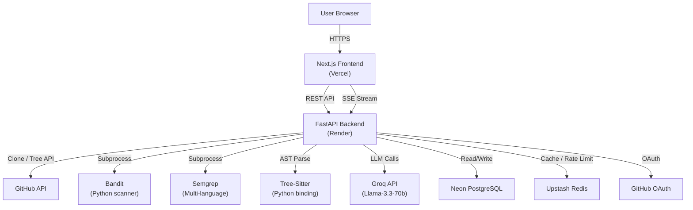
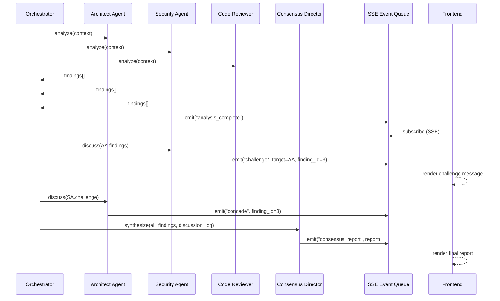
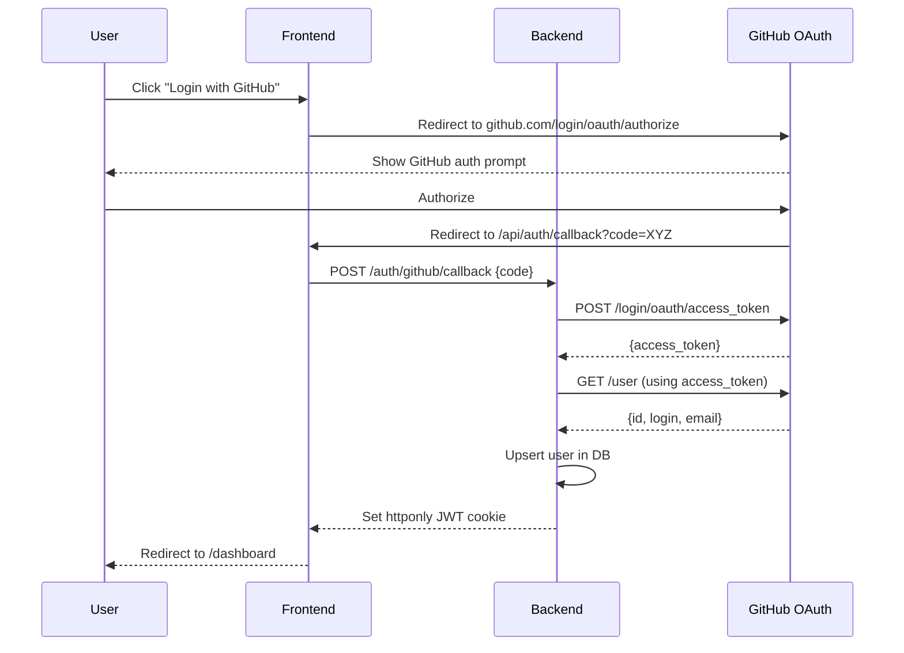
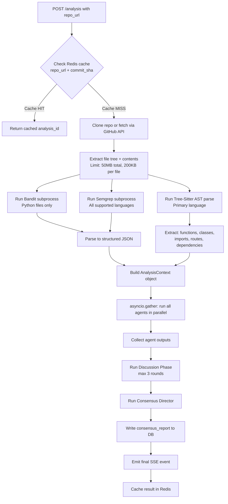
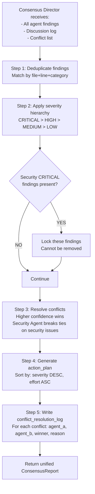

# SYSTEM_ARCHITECTURE.md
# DevCouncil AI — Technical Architecture

---

## High Level Architecture

DevCouncil AI is a three-layer system: a Next.js frontend, a FastAPI backend, and an AI orchestration layer. The backend handles all heavy computation: repository ingestion, static analysis, agent orchestration, and SSE streaming. The frontend is a thin client that renders streamed events and cached report data.



---

## Architecture Decisions

### Frontend: Next.js 14 (App Router)
**Why**: App Router natively supports streaming responses and React Server Components. SSE consumption is straightforward via the `EventSource` API in client components. TypeScript ensures agent message schemas are type-safe across the frontend. Alternative (Vite + React SPA) was rejected because SSE handling requires more boilerplate without App Router's streaming primitives.

### Backend: FastAPI (Python)
**Why**: Python is the only language with mature bindings for Tree-Sitter, Bandit, and Semgrep — all required for grounded agent analysis. FastAPI's async handlers allow parallel agent execution without threads. Flask was rejected (no async). Node.js was rejected (no Tree-Sitter Python binding parity, Bandit is Python-only).

### AI Orchestration: Direct API calls (no LangGraph for MVP)
**Why**: LangGraph adds ~2 days of learning curve for a hackathon. For MVP, the orchestration logic is simple enough to implement as a Python async function: fan out 3–7 Groq API calls in parallel using `asyncio.gather`, collect results, pass to Consensus Director. LangGraph is the correct long-term choice but is out of MVP scope.

### LLM Layer: Groq API + Llama-3.3-70b
**Why**: Groq provides the fastest inference available on a free tier (~500 tokens/sec vs OpenAI's ~50). Llama-3.3-70b is capable of structured JSON output and follows system prompt instructions reliably. Gemini 2.5 Flash (original pitch) requires a paid tier for parallel calls. GPT-4o exceeds budget. Llama-3.3-70b on Groq produces a full 7-agent analysis for under $0.05 and under 30 seconds.

### Task Queue: None for MVP
**Why**: ARQ (Redis-backed task queue) adds infrastructure complexity. For MVP, analyses run as long-running async handlers in FastAPI. Vercel serverless has a 30s timeout — this is solved by running the analysis entirely on the Render backend and streaming results directly from Render, not through Vercel functions.

### Database: Neon PostgreSQL (serverless)
**Why**: Free tier, 0.5GB, serverless (no cold start on Render). Standard SQL — no ORM complexity needed. Schema is simple: 6 tables. Alternative (Supabase) was considered but Neon has a simpler connection model for a Python backend.

### Caching: Upstash Redis
**Why**: Free tier (10K commands/day). Caches: analysis results by repo URL + commit SHA, rate limits per user (5 free analyses/month), SSE session state. Alternative (in-memory dict) was rejected because it doesn't survive Render restarts.

### Authentication: GitHub OAuth + JWT
**Why**: GitHub OAuth is the correct UX for a dev tools product — users already have GitHub accounts. JWT avoids session storage complexity. Expiry: 7 days. The `httponly` flag on the JWT cookie prevents XSS token theft.

### Deployment: Vercel (frontend) + Render (backend)
**Why**: Both have free tiers sufficient for hackathon traffic. Vercel is the fastest Next.js deployment. Render supports persistent Python processes (unlike Vercel serverless) which is required for SSE streaming. Docker on Render ensures consistent dependency installation (Tree-Sitter, Bandit, Semgrep).

---

## Frontend Architecture

```
/app
  /page.tsx                  # Landing page + repo URL input form
  /analyze/[id]/page.tsx     # Analysis view (Discussion Room + Report)
  /dashboard/page.tsx        # User's analysis history
  /api/auth/[...nextauth]/   # NextAuth.js GitHub OAuth handler

/components
  /DiscussionRoom.tsx        # SSE consumer, renders agent messages in real time
  /AgentMessage.tsx          # Single agent message bubble (name, confidence, type)
  /ConsensusReport.tsx       # Final report renderer (severity-grouped findings)
  /FindingCard.tsx           # Individual finding with file path, line, severity badge
  /ConflictResolution.tsx    # Shows "Agent A overruled Agent B — reason: X"
  /RepoInput.tsx             # URL input + analyze button
  /SeverityBadge.tsx         # Color-coded badge (CRITICAL=red, HIGH=orange, etc.)

/lib
  /api.ts                    # Backend API client (fetch wrappers)
  /sse.ts                    # EventSource wrapper with reconnection logic
  /types.ts                  # Agent message types, finding types, report types
```

**State management**: React `useState` + `useReducer` for Discussion Room messages (append-only list). No Redux — overkill for MVP. Analysis result stored in component state after fetch.

**SSE handling**:
```typescript
// /lib/sse.ts
export function connectToAnalysis(analysisId: string, onMessage: (event: AgentEvent) => void) {
  const es = new EventSource(`${BACKEND_URL}/analysis/${analysisId}/stream`);
  es.onmessage = (e) => onMessage(JSON.parse(e.data));
  es.onerror = () => setTimeout(() => connectToAnalysis(analysisId, onMessage), 2000);
  return () => es.close();
}
```

---

## Backend Architecture

```
/app
  main.py                    # FastAPI app, route definitions, CORS config
  /routers
    auth.py                  # GitHub OAuth callback, JWT issue
    analysis.py              # POST /analysis, GET /analysis/{id}/stream, GET /analysis/{id}
    reports.py               # GET /reports/{id}, user report history
  /services
    ingestion.py             # GitHub API client, repo clone, file extraction
    static_analysis.py       # Bandit runner, Semgrep runner, Tree-Sitter parser
    orchestrator.py          # asyncio.gather for parallel agent calls, discussion phase
    consensus.py             # Conflict resolution logic, final report assembly
    cache.py                 # Upstash Redis client wrappers
  /agents
    architect.py             # Architect agent: system prompt, input builder, output parser
    security.py              # Security agent
    code_reviewer.py         # Code Reviewer agent
    product_manager.py       # PM agent (Should Have)
    qa.py                    # QA agent (Should Have)
    documentation.py         # Documentation agent (Should Have)
    consensus_director.py    # Consensus Director agent
    base.py                  # BaseAgent class: call_llm(), parse_output(), retry logic
  /models
    db.py                    # SQLAlchemy models
    schemas.py               # Pydantic schemas for API request/response
  /db
    migrations/              # Alembic migration files
```

**Key endpoint: POST /analysis**
```python
@router.post("/analysis")
async def create_analysis(request: AnalysisRequest, background_tasks: BackgroundTasks):
    analysis_id = str(uuid4())
    await db.create_analysis(analysis_id, request.repo_url, user_id)
    background_tasks.add_task(run_analysis_pipeline, analysis_id, request.repo_url)
    return {"analysis_id": analysis_id}
```

**Key endpoint: GET /analysis/{id}/stream**
```python
@router.get("/analysis/{id}/stream")
async def stream_analysis(id: str):
    async def event_generator():
        async for event in analysis_event_queue.subscribe(id):
            yield f"data: {json.dumps(event)}\n\n"
    return EventSourceResponse(event_generator())
```

---

## AI Orchestration Layer

The orchestration layer runs in `orchestrator.py`. It has three phases:

**Phase 1 — Parallel Agent Analysis**
```python
async def run_parallel_analysis(context: AnalysisContext) -> list[AgentOutput]:
    tasks = [
        ArchitectAgent().analyze(context),
        SecurityAgent().analyze(context),
        CodeReviewerAgent().analyze(context),
    ]
    results = await asyncio.gather(*tasks, return_exceptions=True)
    return [r for r in results if not isinstance(r, Exception)]
```

**Phase 2 — Discussion Phase (Sequential)**
Each agent receives the other agents' summaries and can emit challenges. Max 3 rounds. Each message emitted to the SSE queue immediately.

**Phase 3 — Consensus**
ConsensusDirectorAgent receives all findings + discussion outcomes, applies resolution rules, returns final report.

---

## Agent Communication Flow



---

## Database Design

```sql
-- Users
CREATE TABLE users (
    id UUID PRIMARY KEY DEFAULT gen_random_uuid(),
    github_id VARCHAR(50) UNIQUE NOT NULL,
    email VARCHAR(255),
    username VARCHAR(100),
    created_at TIMESTAMPTZ DEFAULT NOW()
);

-- Projects (unique repos)
CREATE TABLE projects (
    id UUID PRIMARY KEY DEFAULT gen_random_uuid(),
    repo_url VARCHAR(500) UNIQUE NOT NULL,
    repo_name VARCHAR(200),
    primary_language VARCHAR(50),
    created_at TIMESTAMPTZ DEFAULT NOW()
);

-- Analyses (one per run)
CREATE TABLE analyses (
    id UUID PRIMARY KEY DEFAULT gen_random_uuid(),
    project_id UUID REFERENCES projects(id),
    user_id UUID REFERENCES users(id),
    status VARCHAR(20) DEFAULT 'pending', -- pending, running, complete, failed
    commit_sha VARCHAR(40),
    started_at TIMESTAMPTZ,
    completed_at TIMESTAMPTZ,
    cost_usd NUMERIC(8,6),
    created_at TIMESTAMPTZ DEFAULT NOW()
);

-- Agent outputs (one row per agent per analysis)
CREATE TABLE agent_outputs (
    id UUID PRIMARY KEY DEFAULT gen_random_uuid(),
    analysis_id UUID REFERENCES analyses(id),
    agent_name VARCHAR(50) NOT NULL, -- 'architect', 'security', etc.
    status VARCHAR(20) DEFAULT 'pending',
    raw_output JSONB,
    findings JSONB, -- structured findings array
    summary TEXT,
    duration_ms INTEGER,
    created_at TIMESTAMPTZ DEFAULT NOW()
);

-- Discussion turns
CREATE TABLE discussion_turns (
    id UUID PRIMARY KEY DEFAULT gen_random_uuid(),
    analysis_id UUID REFERENCES analyses(id),
    round_number INTEGER NOT NULL,
    agent_name VARCHAR(50) NOT NULL,
    turn_type VARCHAR(20) NOT NULL, -- 'challenge', 'agree', 'concede', 'new_finding'
    target_agent VARCHAR(50),
    target_finding_id VARCHAR(100),
    message TEXT NOT NULL,
    confidence INTEGER,
    created_at TIMESTAMPTZ DEFAULT NOW()
);

-- Consensus reports
CREATE TABLE consensus_reports (
    id UUID PRIMARY KEY DEFAULT gen_random_uuid(),
    analysis_id UUID REFERENCES analyses(id) UNIQUE,
    executive_summary TEXT,
    findings JSONB, -- merged, deduplicated, severity-sorted
    action_plan JSONB,
    conflicts_resolved JSONB,
    created_at TIMESTAMPTZ DEFAULT NOW()
);
```

---

## Authentication Flow



---

## Repository Analysis Flow



---

## Consensus Generation Flow



---

## Error Handling Strategy

**Agent Timeout**: Each agent call has a 30-second `asyncio.wait_for` timeout. If an agent times out, its status is set to `failed` and the analysis continues with remaining agents. The final report notes which agents did not complete.

**LLM Malformed Output**: Agent base class validates JSON output against Pydantic schema. On validation failure, a retry prompt is sent (max 2 retries). If still invalid, the agent's findings are marked as `parse_failed` and excluded from consensus.

**Repo Ingestion Failure**: If GitHub API returns 404 or 403, the analysis immediately fails with a user-facing error message: "Repository not found or not accessible." For repos over 50MB, the analysis is rejected before any API calls are made.

**SSE Disconnection**: If the frontend disconnects from the SSE stream, the analysis continues running in the background. When the user reconnects (or refreshes), the frontend fetches the completed report from `GET /analysis/{id}` instead of reconnecting to the stream.

**Partial Analysis**: If 2 of 3 must-build agents succeed, the Consensus Director runs with available data. This is preferable to blocking the entire report on one agent failure.

---

## Security Considerations

- Repository contents are never written to persistent storage. Files are held in memory/temp during analysis only and deleted after consensus generation.
- GitHub OAuth tokens are never stored in the database. The JWT contains only user ID.
- All LLM API keys are stored as environment variables, never in code or logs.
- Rate limiting: 5 analyses per user per day (free tier), enforced via Upstash Redis.
- CORS: Restrict to the Vercel frontend domain only.
- SQL injection: All DB queries use SQLAlchemy parameterized queries.
- Input validation: Repo URL is validated against `github.com/{owner}/{repo}` pattern before any processing.

---

## Free-Tier Infrastructure Plan

| Service | Provider | Free Tier Limit | Estimated Usage |
|---|---|---|---|
| Frontend hosting | Vercel | Unlimited static, 100GB bandwidth | < 1GB for hackathon |
| Backend hosting | Render | 750 hours/month, 512MB RAM | 1 instance, always on |
| Database | Neon PostgreSQL | 0.5GB storage, 1 compute unit | < 10MB for hackathon |
| Cache | Upstash Redis | 10,000 commands/day | ~50 commands per analysis |
| LLM | Groq | 14,400 requests/day, rate limited | ~70 requests per 7-agent analysis |
| Static analysis | Bandit + Semgrep | Free OSS | No limit |
| GitHub API | GitHub | 5,000 req/hour authenticated | ~10 req per analysis |

**Cost floor**: $0 for hackathon duration. Groq free tier is the binding constraint — 14,400 requests/day / 70 per analysis = ~205 full analyses per day before rate limiting.

---

## Scalability Considerations

These are post-hackathon concerns. MVP does not need to address them.

- Render free tier has 512MB RAM. Tree-Sitter + Bandit + 7 concurrent LLM calls will approach this limit. Solution: upgrade to Render Starter ($7/month) or move to a queue model.
- SSE connections are stateful and require a persistent process. This is incompatible with serverless deployment. Long-term: use a message broker (Redis pub/sub or RabbitMQ) to decouple analysis from streaming.
- Parallel agent execution creates 7 simultaneous Groq API calls. Groq rate limits are per-minute, not per-second. Under load, implement a semaphore limiting to 3 concurrent calls per analysis.
